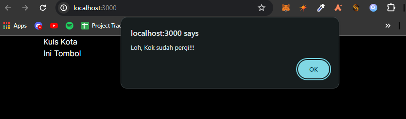
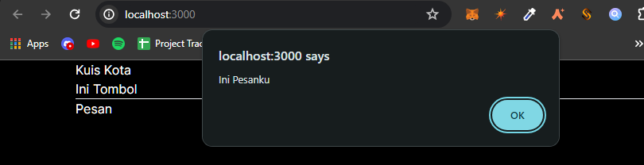

## Laporan Praktikum

|  | Pemrograman Berbasis Framework 2024 |
|--|--|
| NIM |  2141720031 |
| Nama |  Josafat Pratama Susilo |
| Kelas | TI - 3A |

## 04 - Event dan State

# Praktikum 1

Hasil:

# Praktikum 2

Hasil:

Hal tersebut dapat terjadi karena atribut dari komponen Tombol_2, akan dikirimkan melalui props ke komponen Tombol_2, sehingga isi pesan dan nama dari tombol tersebut akan berubah sesuai dengan nilai props yang diterima. Praktek ini akan sangat berguna ketika membuat sebuah komponen dengan style sama namun konten yang berbeda.