## Laporan Praktikum

|  | Pemrograman Berbasis Framework 2024 |
|--|--|
| NIM |  2141720031 |
| Nama |  Josafat Pratama Susilo |
| Kelas | TI - 3A |

## 04 - Event dan State

# Praktikum 1

Hasil:

# Praktikum 2

Hasil:

Hal tersebut dapat terjadi karena atribut dari komponen Tombol_2, akan dikirimkan melalui props ke komponen Tombol_2, sehingga isi pesan dan nama dari tombol tersebut akan berubah sesuai dengan nilai props yang diterima. Praktek ini akan sangat berguna ketika membuat sebuah komponen dengan style sama namun konten yang berbeda.

# Praktikum 3

Hasil:
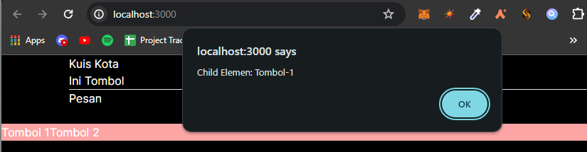
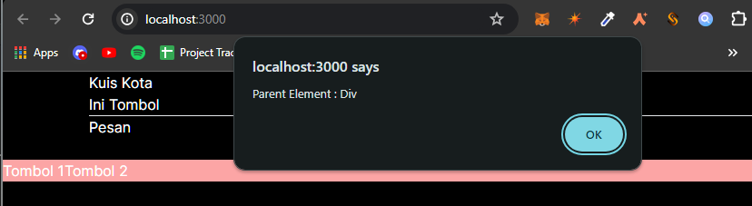

# Praktikum 4

### Soal

1. Jika kita menekan tombol "Artikel Selanjutnya" sebanyak 5x (atau melebihi halaman total artikel), apa yang akan terjadi?
2. Modifikasilah gallery.tsx agar bisa meng-handle permasalahan tersebut.
3. Tambahkan tombol "Artikel Sebelumnya", untuk menampilkan artikel secara mundur.

Silahkan laporkan dan commit dengan judul Jawaban Soal Praktikum 4

### Jawaban

1. Maka property name pada objek sculpture tidak dapat diakses/ditemukan, karena hanya terdapat 5 data di dalam objek tersebut. Sehingga akan muncul error `TypeError: Cannot read properties of undefined (reading 'name')`.
2. Saya mengubah kode pada gallery.tsx terutama pada handleClick menjadi seperti berikut:
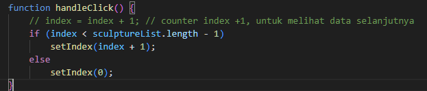
3. Saya mengubah kode pada gallery.tsx dengan menambahkan handleBefore dan buttonnya menjadi seperti berikut:
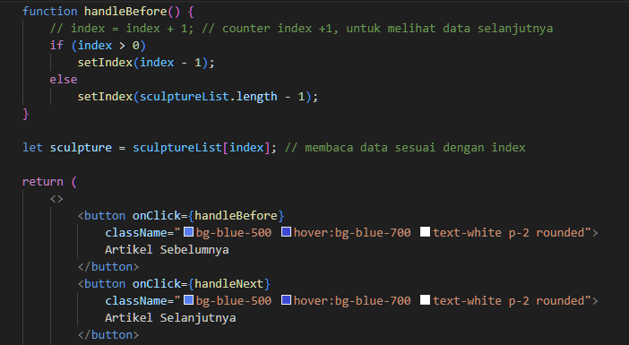

Hasil:
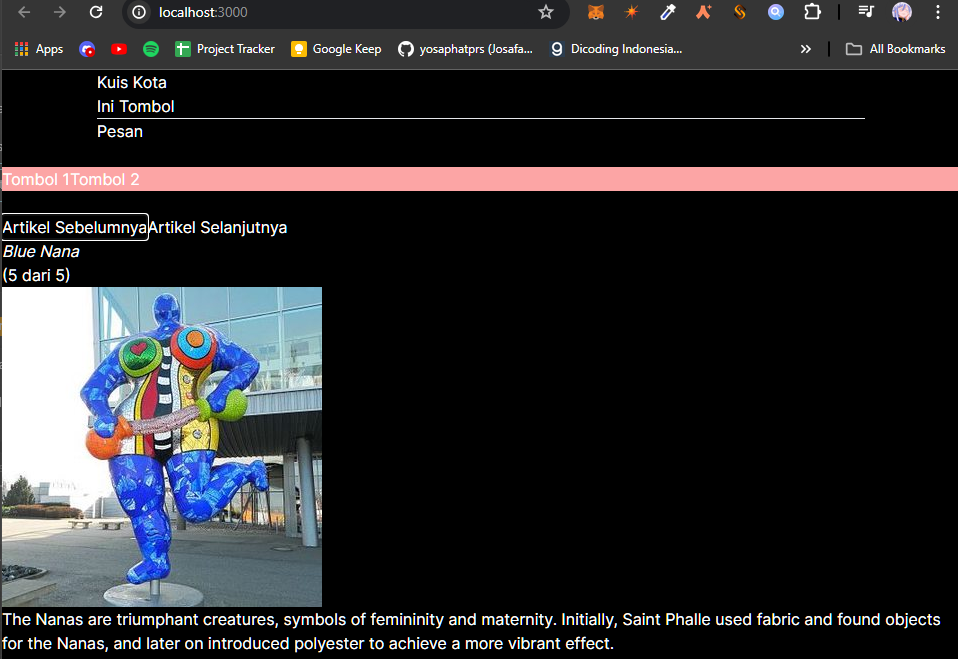

# Praktikum 5

Hasil Awal (Jawaban Salah):
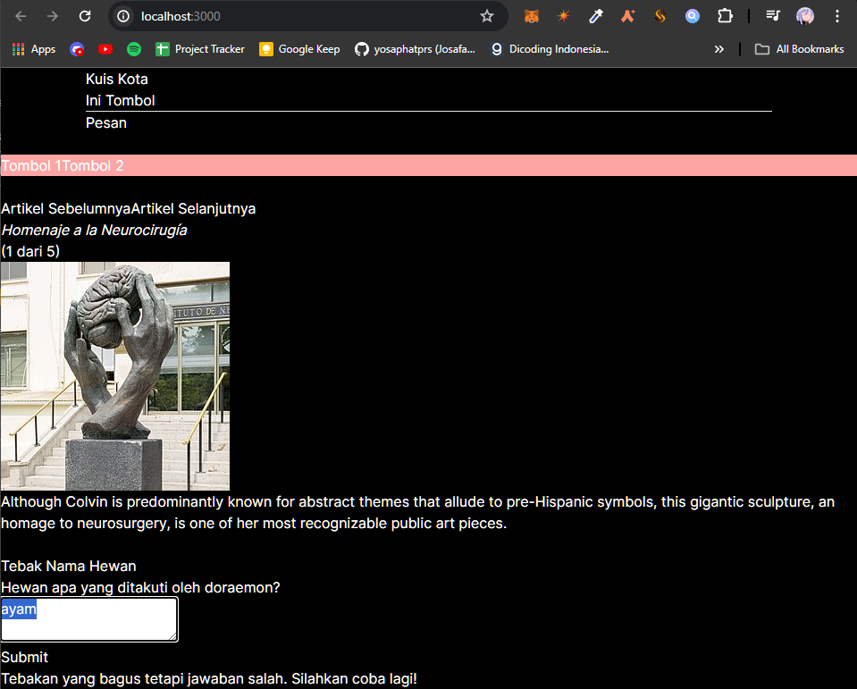

Hasil Kedua (Jawaban Benar):
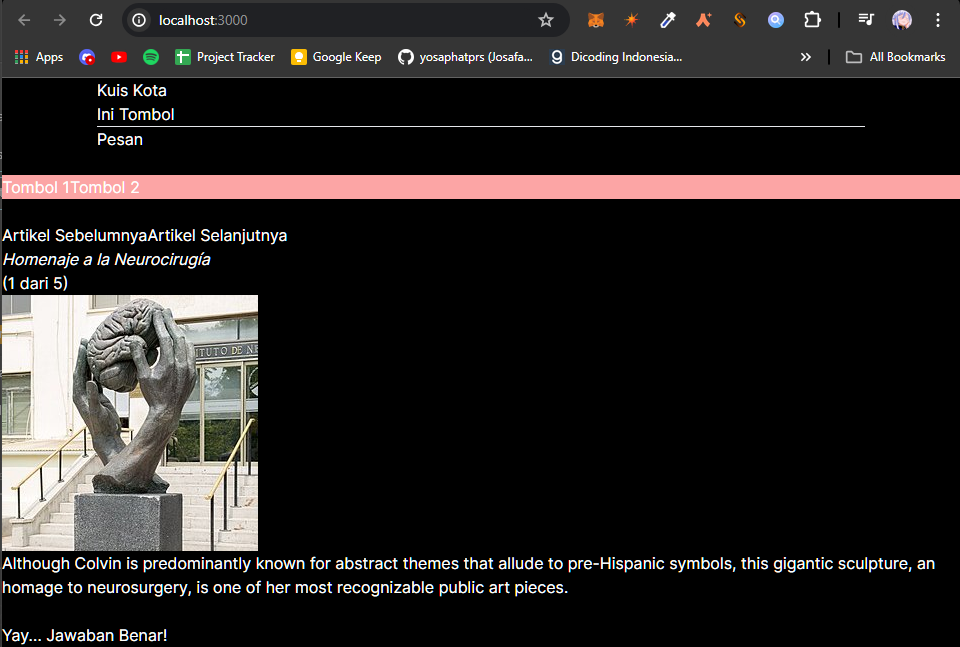

Hasil Form_2:
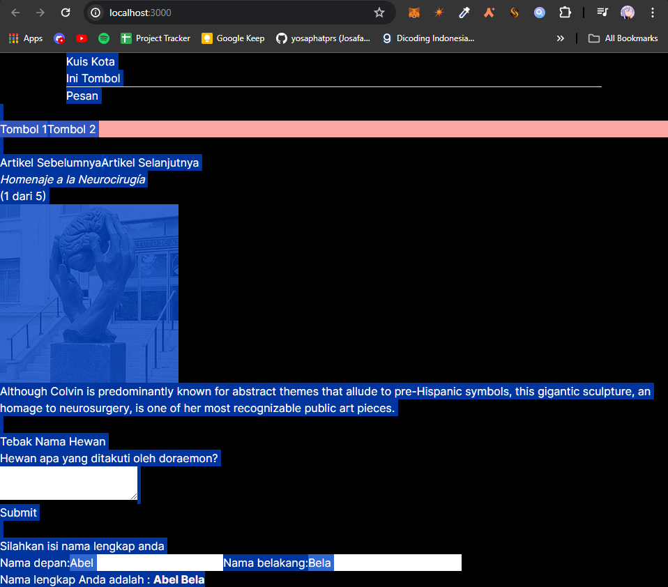

### Soal
1. Apa perbedaan dari fungsi Form_2 yang pertama dengan yang kedua?
2. Kenapa perlu menghapus state fullName? Apa keuntungannya?

Silahkan laporkan dan commit dengan judul Jawaban Soal Praktikum 5

### Jawaban
1. Pada Form_2 tidak ada perbedaan fungsi, karena sama-sama menyambungkan string dari nama depan dan nama belakang, hanya saja pada yang kedua digabungkan dalam sebuah konstanta langsung tanpa menggunakan state.

2. Hal tersebut diperlukan karena dapat meminimalisir adanya bug pada aplikasi jika terlalu banyak menggunakan state untuk menyimpan sebuah nilai, karena jika nilai tersebut hanya digunakan untuk menampilkan akan lebih baik jika menggunakan konstanta langsung tanpa menggunakan state.

# Praktikum 6

Hasil (About):
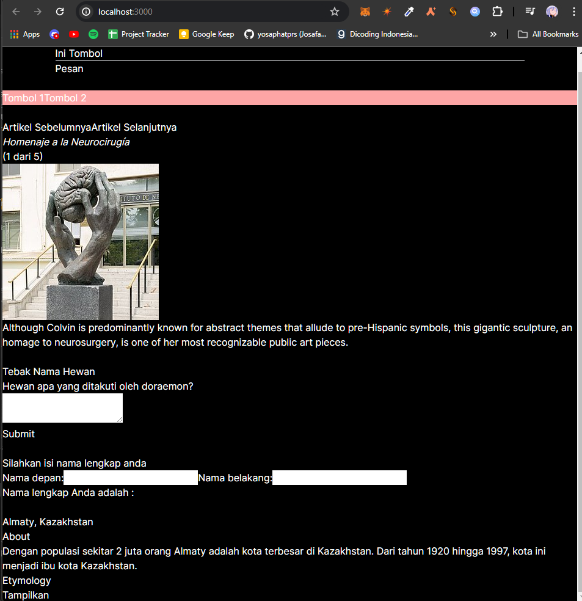

Hasil (Etymology):
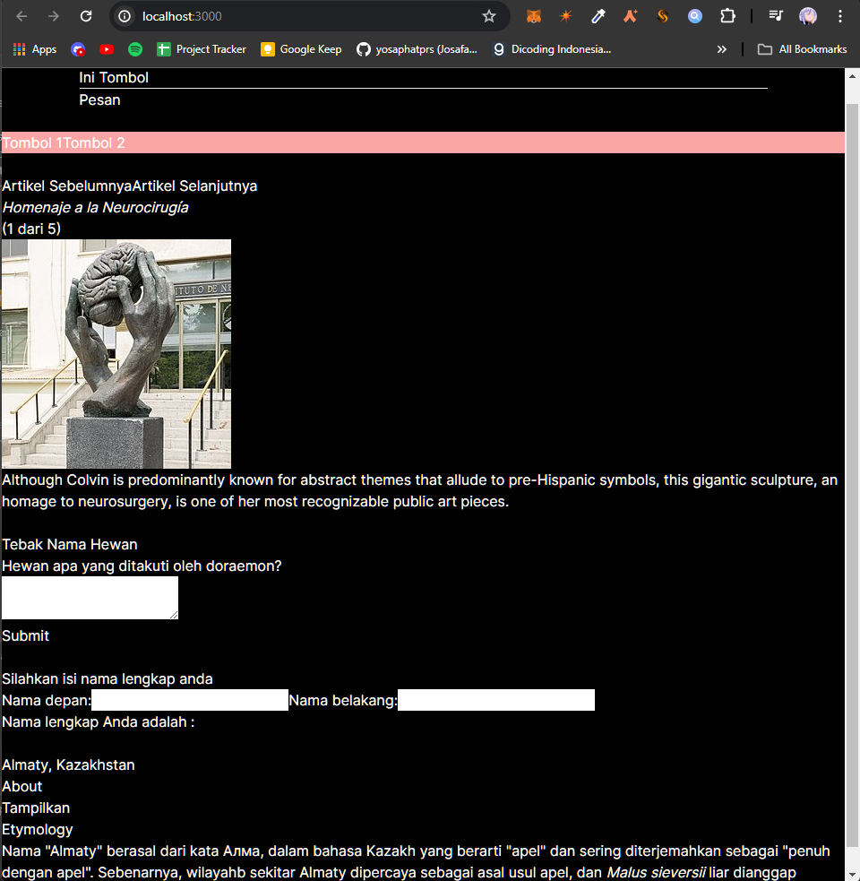

### Soal
1. Apa tujuan dari penulisan ini key={to.email} pada < Chat key={to.email} contact={to} / > ?

2. Apa fungsi dari props key tersebut?

Silakan laporkan dan commit dengan judul Jawaban Soal Praktikum 6

### Jawaban
1. Tujuan dari penulisan key={to.email} pada < Chat key={to.email} contact={to} / > adalah untuk memberikan key pada komponen Chat agar React dapat membedakan komponen tersebut dan membuat komponen baru yang berbeda dari masing-masing key-nya.

2. Fungsi dari props key tersebut adalah untuk memberikan key pada komponen agar React dapat membedakan antara satu komponen dengan komponen lainnya.

Hasil Kedua:
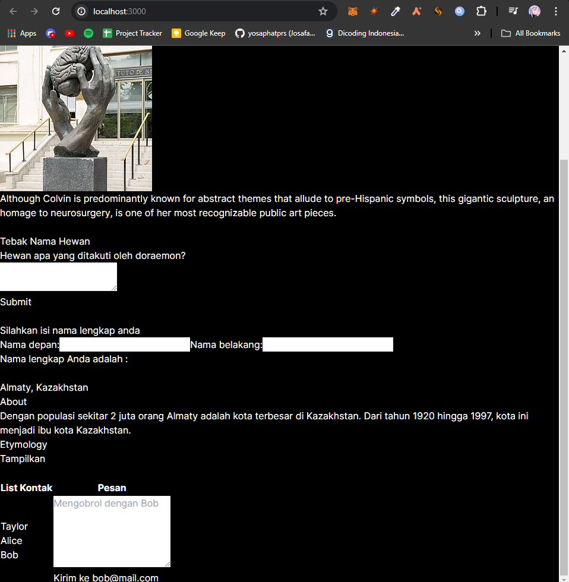